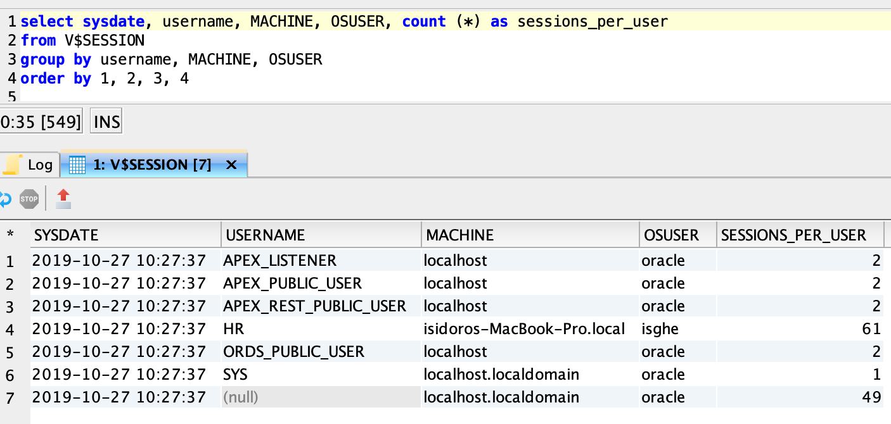

# Oracle Java Examples

Simple examples, showing how to connect to ORACLE DB, with Java ojdbc driver, and how to make inserts without polluting ORACLE environment.

The examples are:
* `HelloWorld`:
Just a simple query to table `DUAL`;
* `WrongWay`:
Inserting data in table `TEST_INSERT`, in wrong way: opens the connection for each insert, without closing the connection. Because of that it's polluting the ORACLE environment with tons of SESSIONS_PER_USER, until the system resources run out!
* `CorrectWay`:
Just closes the balanced connection with the open ones. At least it's not polluting the ORACLE environment; but it's unnecessary opening and closing the connection for each insert;
* `GoodWay`:
Opens the connection to ORACLE only on time, closing it one time at the end of the program;
* `BetterWay`:
One connection, one commit. (making on commit, it depends on what you need).

# Install

Download `ojdbc7.jar` from [jdbc-drivers-12c-downloads](https://www.oracle.com/database/technologies/jdbc-drivers-12c-downloads.html) and copy it in `lib/` folder.

To run the examples `WrongWay`, `CorrectWay`, `GoodWay`, `BetterWay`, execute the script in `sql/create-table_test_insert.sql`; it will create the table `TEST_INSERT` in your DB.

# Configure

Copy `Configure/Credentials-template.java` to `Configure/Credentials.java` and modify the credentials you need (url, user and password).

# Compile

`$ cd examples/HelloWorld`

`$ . ../../script/compile.sh`

# Run
`. ../../script/run.sh`

# Monitor
To monitor the SESSIONS_PER_USER execute the query in `sql/sessions_per_user.sql`

MonitorWrongWay,: 61 SESSIONS_PER_USER polluting ORACLE environment:

MonitorCorrectWay: just 3 SESSIONS_PER_USER:

